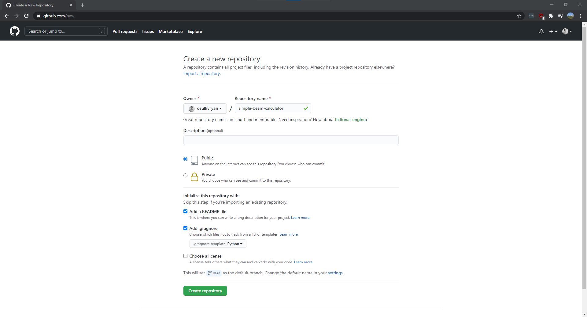

# Starting A Project

Remember, we're going to go through an example of creating a new project, `simplebeamcalculator`. You'll see this throughout. 


## Creating a Project in Git

For this example we're going to start a project in Github, however the steps are similar in Gitlab. 

I'm going to name my project `simple-beam-calculator`, and then set some defaults for the README and the [.gitignore](https://git-scm.com/docs/gitignore) file.



!!! note
    I used "kebab" case for the naming (the dashes between the words "simple", "beam", and "calculator" make it look like a kebab). I prefer this style. It's that simple.

## Cloning the project

You'll need to start by cloning this new repository onto your own machine. On the git page you should see the `Code` dropdown and within that dialog box a link that ends in `.git`. This is your git repository link. For me it looks like:

`git@github.com:osullivryan/simple-beam-calculator.git`
 
Copy it.

I normally keep all of my git projects in the same directory to help me keep track of them all. So I'm going to run this command **from within the directory I want the files**:

```bash
git clone git@github.com:osullivryan/simple-beam-calculator.git
```

After this you should change into that new directory:

```bash
cd simple-beam-calculator
```

## Folder Structure

Folder structure (and in a sense package structure) in Python is *hard and confusing*. I've found a structure that works well and is reliable, so this is how I'll set us up.

1. Create two new directories, `src` and `tests`. `src` stands for `source`.
2. Within `src` create a directory called `simplebeamcalculator`. This is going to be our main package. 
3. Create an empty `__init__.py` file within `src/simplebeamcalculator`. This tells Python to look for source files here.

As your package grows you'll create more folders under `src/simplebeamcalculator`. For now you should see something like this:

```
simple-beam-calculator
│   README.md
│   .gitignore    
│
└───src
│   └───simplebeamcalculator
│       │   __init__.py
│   
└───tests
```


## Initializing Poetry

[Poetry](../environment/installing-tools.md) is our environment and package manager. It will take care of our packages and python instances for us. We need to initialize it in this new project by running the command:

```bash
poetry init
```

!!! note
    If you chose to name your package in kebab case make sure you remove them in the package name!

In the end I ended up entering these options:
```
PS C:\Users\osull\git_projects\simple-beam-calculator> poetry init

This command will guide you through creating your pyproject.toml config.

Package name [simple-beam-calculator]:  simplebeamcalculator
Version [0.1.0]:
Description []:
Author [Ryan O'Sullivan <osullivryan@gmail.com>, n to skip]:
License []:
Compatible Python versions [^3.9]:

Would you like to define your main dependencies interactively? (yes/no) [yes] no
Would you like to define your development dependencies interactively? (yes/no) [yes] no
Generated file

[tool.poetry]
name = "simplebeamcalculator"
version = "0.1.0"
description = ""
authors = ["Ryan O'Sullivan <osullivryan@gmail.com>"]

[tool.poetry.dependencies]
python = "^3.9"

[tool.poetry.dev-dependencies]

[build-system]
requires = ["poetry-core>=1.0.0"]
build-backend = "poetry.core.masonry.api"


Do you confirm generation? (yes/no) [yes] yes
PS C:\Users\osull\git_projects\simple-beam-calculator>
```

Finally you should be able to install the Python environment:

```bash
poetry install
```

And you should be able to start python by running the following:

```bash
poetry run python
```
