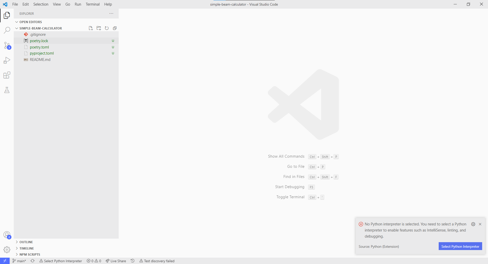
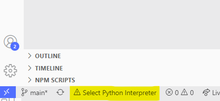
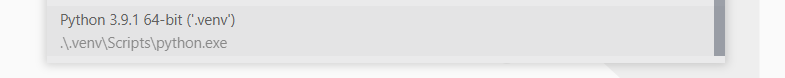

# Visual Studio Code

VSCode setup should be quite straightforward! These are a handful of helpful hints and tips. 

## Opening up a Project from Scratch

From within the project directory you should type the command:

```bash
code .
```

`code` is the command for VSCode, and the `.` opens VSCode in the current directory. It should look something like this:



## Saving a Workspace

Workspaces save your setting so you can configure VSCode in different ways depending on what you're working on.

Go to:

1. `File` -> `Add Folder to Workspace...` and select the **current directory**. 
2. Then `File` -> `Save Workspace As...` and select the **current directory**. 

## Setting your Python Interpreter

The first time you open a project in VSCode the Python extension will look around for a Python interpreter. We're going to select the one we created from the `poetry install` command, which should be *local in this current directory under .venv*.

Select the option for interpreters at the bottom left of the window.



Then select the local `.venv/` interpreter. You might have quite a few here depending on your environment. We want the one for this project only.

