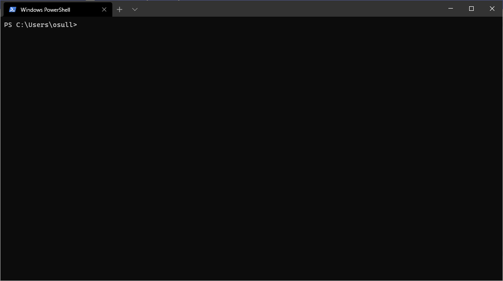
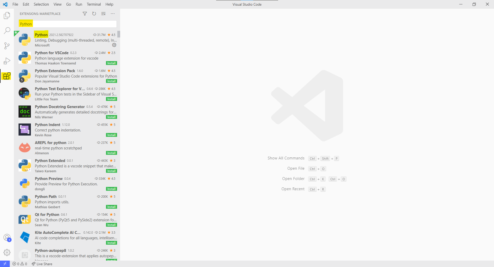

# Installing Your Tooling

## Windows Terminal

!!! note
    Windows Terminal isn't required, PowerShell or the standard command prompt will work just fine. However,
    the Windows Terminal has a lot of quality of life improvements like `Ctrl-C/V` for copying and pasting.

The Windows Terminal is a great improvement over the default command prompt, and is what I'll be using to 
show commands throughout this document. Install it from [**here**](https://www.microsoft.com/en-us/p/windows-terminal/9n0dx20hk701?activetab=pivot:overviewtab).




## Python

Python can be installed in a multitude of ways, but an easy way to install it on Windows is through the Microsoft Store [**here**](https://www.microsoft.com/en-us/p/python-39/9p7qfqmjrfp7#activetab=pivot:overviewtab). The requirements for Python are:

1. A version >= 3.8.
2. Evaluable on the system path:

```bash
PS C:\Users\osull> python
Python 3.9.1 (tags/v3.9.1:1e5d33e, Dec  7 2020, 17:08:21) [MSC v.1927 64 bit (AMD64)] on win32
Type "help", "copyright", "credits" or "license" for more information.
>>>
```

## Poetry

Poetry is like `pip` but *way* better. It creates python environments as needed. I'll be using it to install packages, configure testing, and deploying packages throughout these documents. Follow the steps [**here**](https://python-poetry.org/docs/) to install. 

!!! note
    On Windows part of the steps to install Poetry are to add the `bin` path to your PATH system environment variable. The basic steps are:

    1. Search for the `Edit the system environment variables` in the Start menu.
    2. Select *Environment Variables...*
    3. Find `Path` and select `Edit`
    4. Select `New`
    5. Add `%USERPROFILE%\.poetry\bin` as a new entry at the bottom of the list.
    6. Log out and log back in to initialize your path again.

Once you have poetry installed you should be able to run the `poetry --version` command:

```bash
PS C:\Users\osull> poetry --version
Poetry version 1.1.4
```

!!! important
    It's best practice to have poetry create the environments within the package directory. Use the following command to do so:

    ```bash
    poetry config virtualenvs.create false --local
    ```


## Visual Studio Code

Visual Studio Code (VSCode) can be thought of as either a very lightweight IDE, or a very detailed text editor. We are going to be using it more as an IDE. Install it from [**here**](https://code.visualstudio.com/)

### VSCode Extensions

There are so many awesome extensions for VSCode. I typically have a dozen installed at one time. There are at least two that you'll need (Python and Pylance) and I've listed some others that I just like to use.

#### Python
This is the go-to python extension for VSCode. This will make your life so much different.


#### Pylance
This is the (fairly new) language server for the python extension. 


## Git
Git is the primary source-control tool used today. Github (a git-based company) has a great guide for installing git [here](https://docs.github.com/en/github/getting-started-with-github/set-up-git), however you should use your repository's steps to make sure you set up your SSH keys, which will be needed to push/pull from projects. Some basic things you'll have to do:

1. Use the git-bash to retrieve SSH keys.
2. Upload those SSH keys to your git repository.
3. Configure your name and email address in git.
